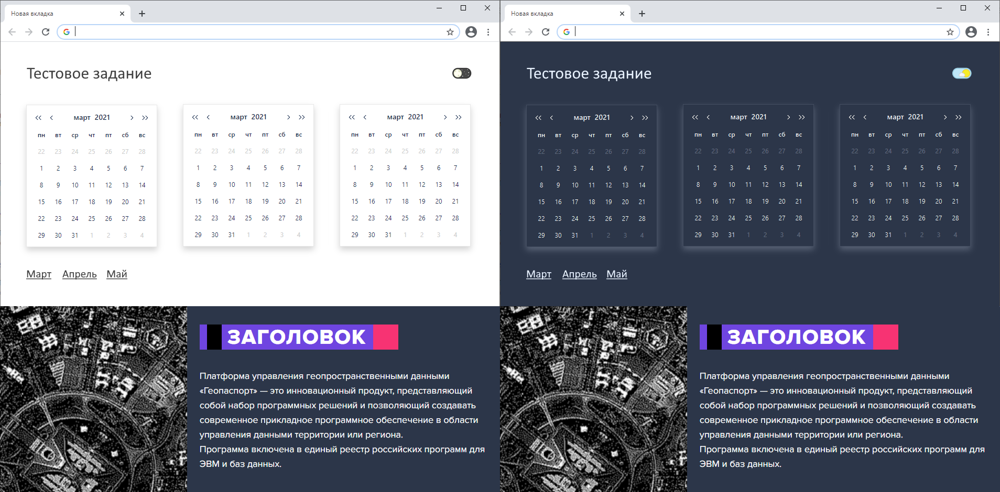

# Тестовое задание
## Задача
- Сверстать страницу HTML+JS+CSS максимально близко к макету
  
- При нажатии на кнопку в правом верхнем углу меняется цветовая схема страницы
- При нажатии на ссылку с названием месяца все три календаря меняют месяц на выбранный.
  Внутри календарей интерактивность не требуется.

При необходимости можно использовать любые библиотеки и фреймворки"

Решение можно посмотреть на gh-pages [ссылка](https://vrg26.github.io/test-task/)
